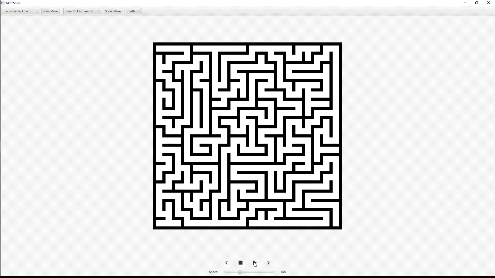

MazeSolver

My attempt at animating maze solving algorithms, I got the idea (and an idea of how to do it) from this video (https://www.youtube.com/watch?v=rop0W4QDOUI)

Still have to brush up the settings screen as currently there's no input validation. Also need to implement some more generation algorithms but just the one works well enough.

